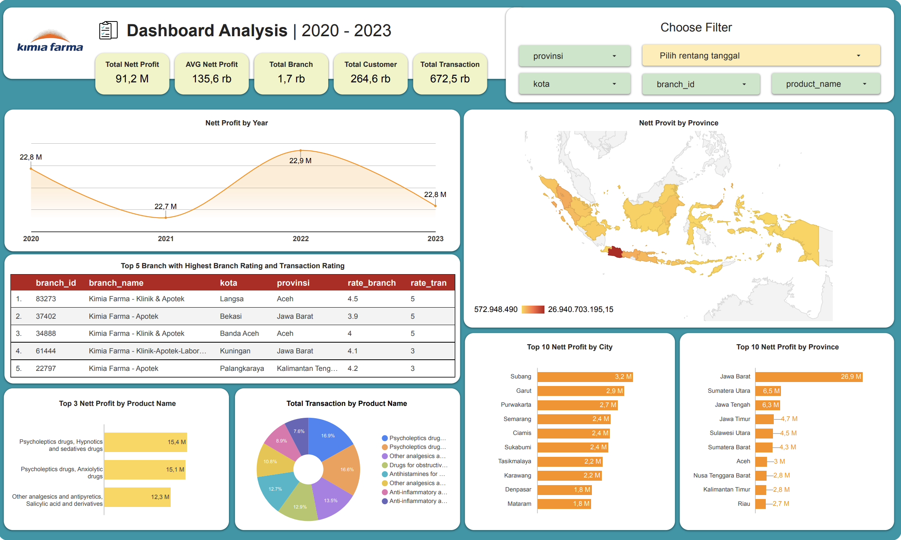

# 📊 Kimia Farma Business Performance Analysis  

Selamat datang di repository **Final Task - Big Data Analytics Kimia Farma**.  
Project ini merupakan bagian dari program **Magang Big Data Analytics Rakamin x Kimia Farma**, yang berfokus pada analisis kinerja bisnis menggunakan **Google BigQuery** untuk pemrosesan data dan **Google Looker Studio** untuk visualisasi dashboard.  

---

## 🚀 Project Overview  

PT Kimia Farma Tbk adalah perusahaan farmasi milik negara (BUMN) yang telah berdiri sejak masa kolonial Belanda dan resmi menjadi persero pada tahun 1971.  
Sebagai penyedia layanan kesehatan terpadu, Kimia Farma mencakup **R&D, produksi obat & bahan baku, distribusi, hingga layanan ritel (apotek, klinik, laboratorium)**.  

Dalam project ini, saya melakukan **analisis performa bisnis** dengan mengolah lebih dari 30.000 data transaksi dari beberapa tabel:  

- `kf_product` → data produk  
- `kf_inventory` → data inventori  
- `kf_kantor_cabang` → data cabang  
- `kf_final_transaction` → data transaksi  

---

## 🛠️ Proses & Langkah Pengerjaan  

1. **Import Dataset ke BigQuery**  
   - Membuat project `Rakamin Academy Data Science`  
   - Membuat database `kimia_farma`  
   - Mengimport 4 dataset utama  

2. **Membangun Challenge Table**  
   - Menggabungkan keempat dataset menjadi satu tabel analisa  
   - Menambahkan kolom penting seperti:  
     - `nett_sales` 
     - `nett_profit`
     - `presentase_gross_laba`  
   - Dataset inilah yang digunakan sebagai dasar dashboard analisis.  

3. **Dashboard Development (Looker Studio)**  
   - Membuat dashboard interaktif dengan beberapa komponen:  
     - Total Nett Profit  
     - AVG Nett Profit  
     - Total Branch  
     - Total Customer  
     - Total Transaction  
   - Visualisasi tren nett profit tahunan, top cabang, top produk, hingga sebaran nett profit berdasarkan provinsi.  

---

## 📈 Key Insights  

- **Tren Tahunan** → Nett profit 2020–2023 menunjukkan pola naik turun, dengan performa terbaik di tahun 2022.  
- **Top Cabang** → Kimia Farma Klinik & Apotek (Langsa, Aceh) mencatat rating cabang 4,5 dan rating transaksi 5.  
- **Top Produk** → Psycholeptics Drugs, Hypnotics & Sedatives Drugs → nett profit 15,4 M (16% dari total transaksi).  
- **Top Kota & Provinsi** → Subang (3,2 M) dan Jawa Barat (26,9 M) sebagai penyumbang utama nett profit.  
- **Sebaran Provinsi** → Provinsi dengan nett profit rendah dapat dijadikan target strategi pasar berikutnya.  

---

## 📊 Dashboard  

Berikut adalah hasil visualisasi dashboard pada **Google Looker Studio**:  

  

🔗 [Lihat Dashboard Lengkap di Looker Studio](https://lookerstudio.google.com/reporting/69d60805-a7ee-482c-b059-46cadf110189)

---

## 🛠️ Tech Stack  

  

---

## 📫 Kontak  

- 📧 Email: **anantaanan69@gmail.com**  
- 💼 LinkedIn: [Yusuf Ananta Tirtodjojo](https://www.linkedin.com/in/yusuf-ananta-tirtodjojo/)  

---

✨ _“Data tells the story, analytics brings the insight.”_ ✨
